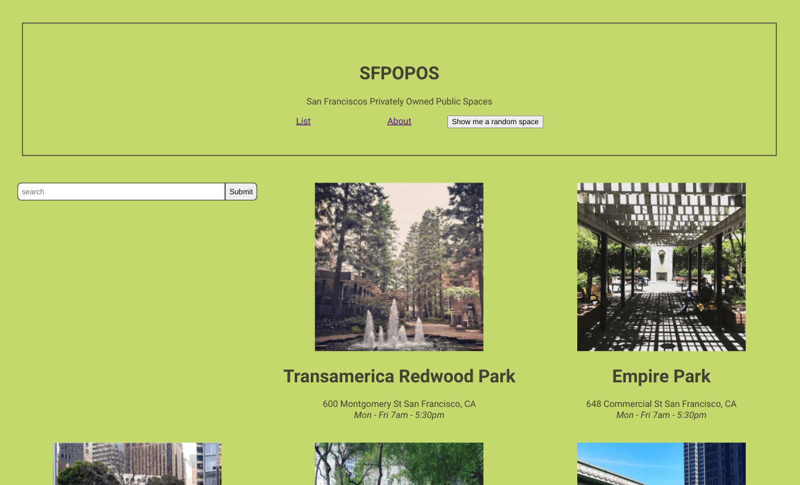
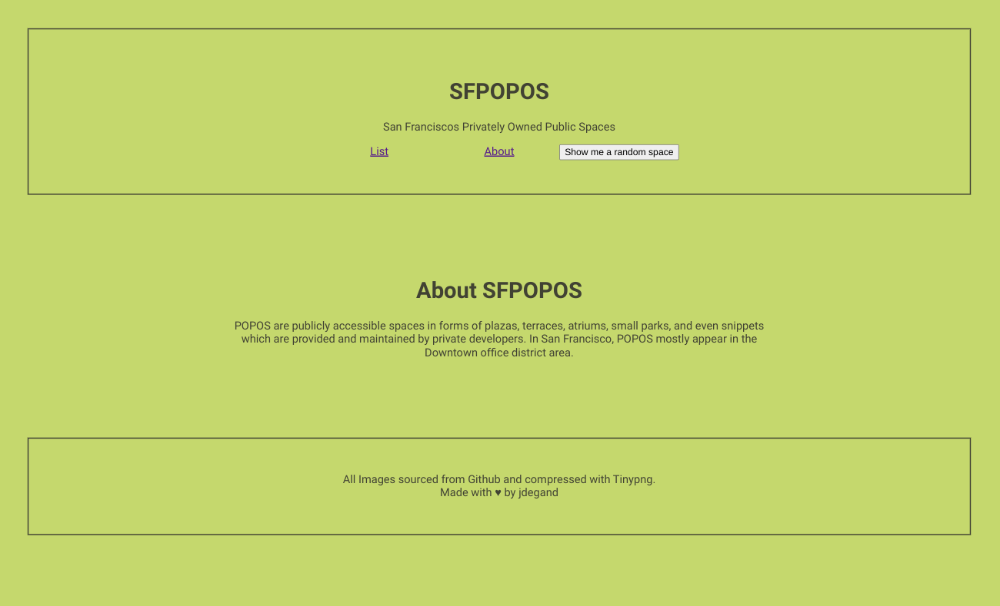
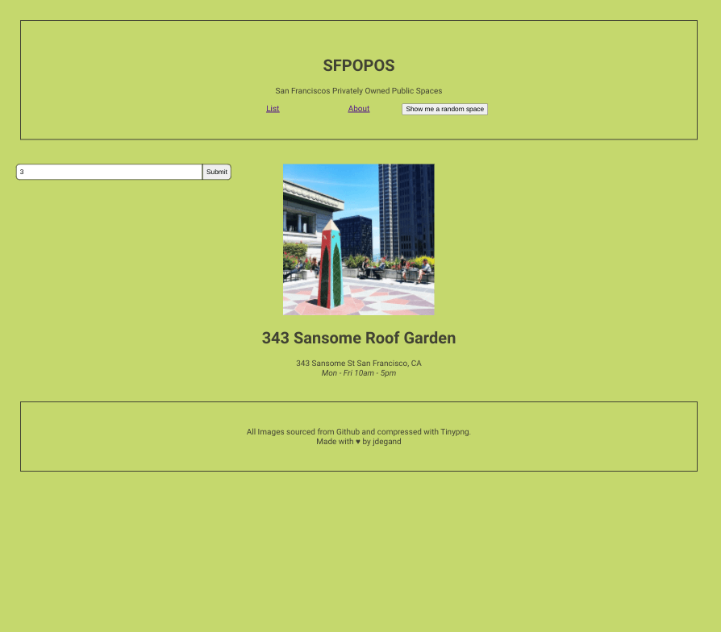
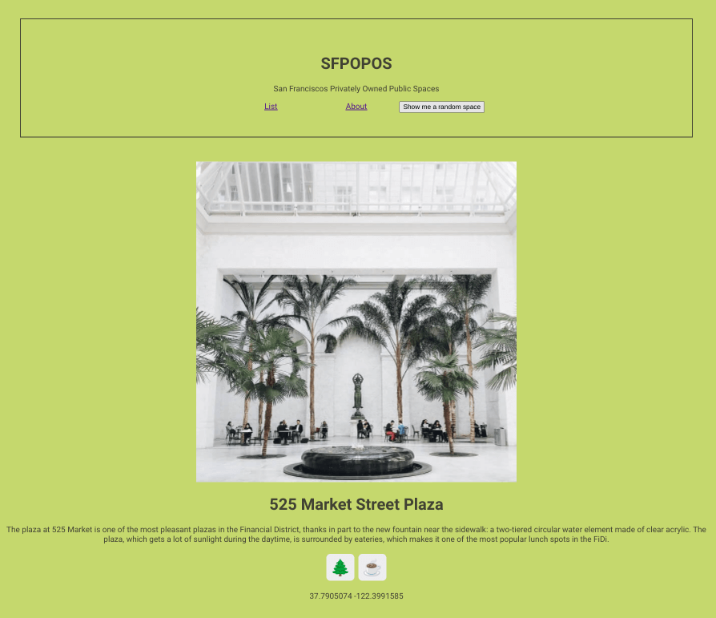
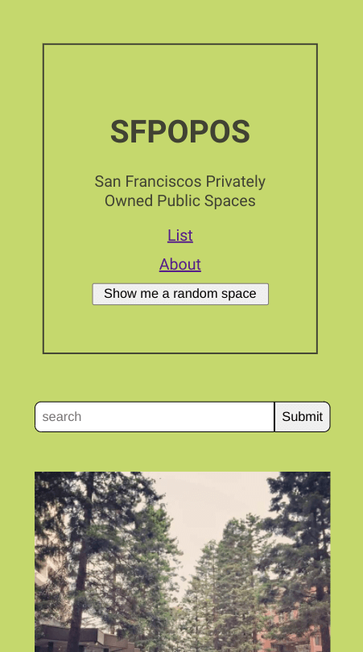

<h1 align="center">React Fundamentals - SFPOPOS</h1>

   Tutorial from  <a href="https://makeschool.org/mediabook/oa/tutorials/react-fundamentals-vm0/setting-up-react/" target="_blank">makeschool.org</a>.

## Table of Contents

- [Overview](#overview)
  - [Built With](#built-with)
- [Features](#features)
- [Improvements](#improvements)
- [Useful Resources](#useful-resources)

## Overview

MakeSchool was a coding bootcamp that went under.  Most content was made free and I found this and decided to follow along.

### Built With

- React
- React Router 6

## Features

Updated from React Router 5 to 6.

## Improvements

- Styling
- Performance
- Accessibility & better semantic HTML
- Use real API for data
- placement of images - better for webpack

### Resources 

- [Stack Overflow](https://stackoverflow.com/questions/68362865/missing-isactive-prop-on-navlink-of-react-router-v6) - activeClassName doesn't exist in v6
- [Stack Overflow](https://stackoverflow.com/questions/63471931/using-history-with-react-router-dom-v6) - useHistory is now useNavigate